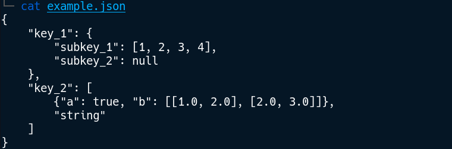
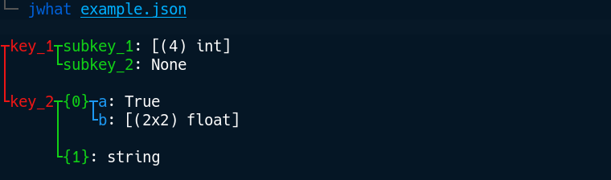

J-What
==================
This tool prints a readable tree-view summary of the structured data stored inside a JSON file.

### Features

* Tree-view visualization of dictionaries and lists
* Keys colored per depth level for better readability
* Automatic collapsing of data arrays, even multi-dimensional

## Installation

```
git clone https://github.com/Askannz/jwhat
cd jwhat/
python setup.py install
```

## Usage

```
usage: jwhat [-h] [-v] [-d MAX_DEPTH] [--no-color] [FILE]

A tool to summarize JSON files

positional arguments:
  FILE                  Input file name containing a valid JSON.

optional arguments:
  -h, --help            show this help message and exit
  -v, --version         Print version and exit.
  -d MAX_DEPTH, --max-depth MAX_DEPTH
                        Maximum tree depth
  --no-color            Disable colored output
```

## Example




